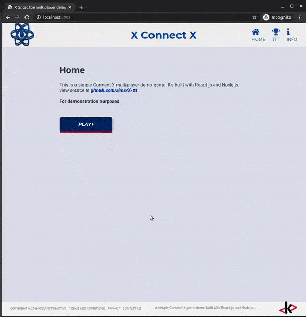

# A simple example of a full multiplayer game web app built with React.js and Node.js stack

Major libraries used on front end:
- react
- webpack
- babel
- react-router
- ampersand
- sass
- jest

Major libraries used on server:
- node.js
- socket.io
- express

### Folder structure:
- **WS** - server side and compiled front end
- **react_ws_src** - React development source and testing

---

This work is based on https://github.com/xims/X-ttt

### View it online at 
https://x-ttt.herokuapp.com/

#### Configurable with external XML file - 
https://x-ttt.herokuapp.com/ws_conf.xml

---

##For demonstration purposes only.
